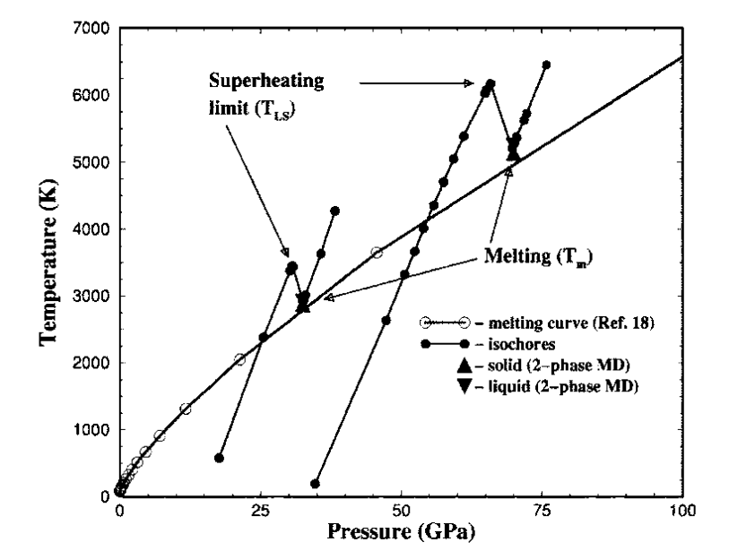
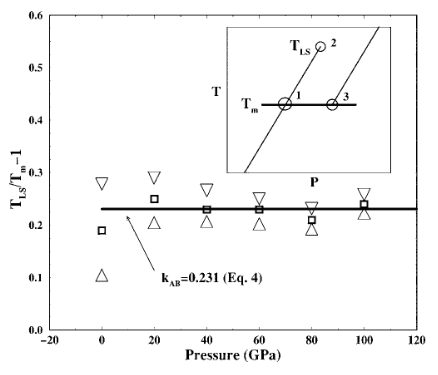

# Melt

## 2006 Melting and critical superheating

### Introduction

- melting initiated due to inhomogeneities
- if a crystal melts homogeneously, it can be overheated
- superheating is a rare phenomenon in nature but common in simulation
- reason is that periodic boundary conditions(PBC) is used in simulations

#### Aim

- establish a connection between $T_{LS}$ and $T_m$

#### details of MD methods

- interaction: Lennard Jones Potential
- heat method:a certain amount of kinetic energy is provided to the fcc crystal in the very beginning of the MD simulations. After that, the system is allowed to evolve on its own, equilibrating to some T.

### result

when heat a crystal at a constant volume(V), the pressure(P) increase with T, when T approaches $T_{LS}$, a very small increase in the initial kinetic energy leads to melting, and the temperature drops to $T_m$.

Due to the heating method, we have

$$
U^{\text {Solid }}\left(V, T_{L S}\right)=U^{\text {Liquid }}\left(V, T_{m}\right)
$$

- homogeneous melting
  - melting occurs when the internal energy of solid state is sufficient to explore the potential energy landscape of liquid state.
  - crystal melts to minimize the Helmholtz free energy.

- heterogeneous melting
  - a liquid gets stabilized by entropy
  - in solid at $T<T_{LS}$, the mechanism is suppressed.

- the absence of the states with high entropy is the reason for superheating

$$
U_{2}\left(T_{L S}, V\right)-U_{1}\left(T_{m}, V\right)=U_{3}\left(T_{m}, V\right)-U_{1}\left(T_{m}, V\right)
$$

$$
3 k_{B}\left(T_{L S}-T_{m}\right)=T_{m} k_{B} \ln 2
$$

$$
\frac{T_{L S}}{T_{m}}-1=\frac{\ln 2}{3}
$$
