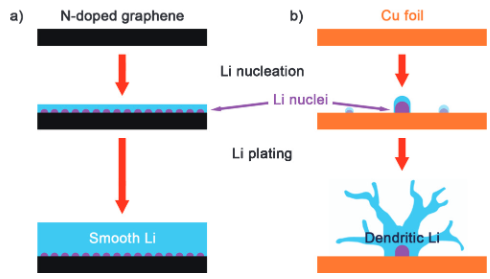
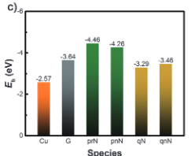
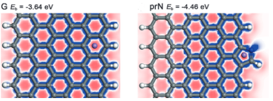

# Lithiophilic Sites in Doped Graphene Guide Uniform Lithium Nucleation for Dendrite-Free Lithium Metal Anodes

1. some Nitrogen contained functional groups are lithiophilic
2. lithiophilic material can guile Li nucleate uniformly on the anode surface.

Li dendrite cause $\to$

1. dead Li $\to$ capacity lose
2. internal short circuit
3. ...

Possible solutions

electrolyte modifications neglecting the initial nucleation process ,however, some experimental work show that .

1. Li nuclei size heavily dependent on current density .
2. nucleation sites rely on lithiophilic matrix $\to$ strong binding energy

$\to$ high surface area(density)， lithiophilic surface(sites)

nitrogen-doped graphene (NG).

electric field, concentration gradient $\to$ Li migrate toward anode surface.

heterogeneous and rough Cu foil surface $\to$ non-uniform deposition

$overpotential_{Li-Li}< overpotential_{Li-Cu}$ $\to$ dendrite.

Due to lithiophilic functional groups, uniform nucleation sites smaller overpotential.

NG functional groups mainly qnN,prN.

Based on DFT calculation, compare the binding energy and electron density

Due to strong binding energy for N and Li, metallic Li atoms on lithiophilic sites

With Much more lower over potential ,Li ions exhibits lower resistance to deposit on electrode surface .
