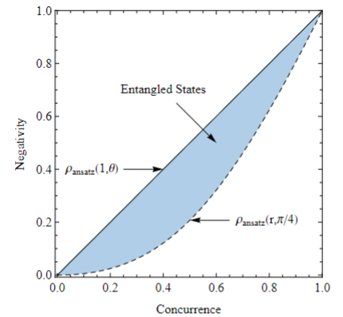

# 文献调研

## 2010 Residual effect on the robustness of multiqubit entanglement

### Two-qubit system

- depolarizing channel
- robustness completely depends on its initial entanglement

    $$R=1-\frac{1}{\sqrt{1+2 N}}$$

### Three-qubit system

- depolarizing channel
- three-tangle is the highest quality entanglement

## 2012 Dynamics of Entanglement for a Two-Parameter Class of States in a Qubit-Qutrit System

state:

$$
\begin{aligned}
\rho_{b c}(0)=& a(|02\rangle\langle 02|+| 12\rangle\langle 12|)+b\left(\left|\phi^{+}\right\rangle\left\langle\phi^{+}\right|\right.\\
&\left.+\left|\phi^{-}\right\rangle\left\langle\phi^{-}|+| \psi^{+}\right\rangle\left\langle\psi^{+}\right|\right)+c\left|\psi^{-}\right\rangle\left\langle\psi^{-}\right|
\end{aligned}
$$

where:

$$
\begin{aligned}
\left|\phi^{\pm}\right\rangle &=\frac{1}{\sqrt{2}}(|00\rangle \pm|11\rangle) \\
\left|\psi^{\pm}\right\rangle &=\frac{1}{\sqrt{2}}(|01\rangle \pm|10\rangle)
\end{aligned}
$$

density matrix influenced by environment:
$$\rho_{b c}^{A B}(t)=\sum_{i=1}^{2} \sum_{j=1}^{3} F_{j}^{B} E_{i}^{A} \rho_{b c}^{A B}(0) E_{i}^{A \dagger} F_{j}^{B \dagger}$$

decoherence model

- one part of the AB system is exposed to noise
- both A and B are exposed to the environment

Comparing the results in dephasing, phaseflip, bit(trit)Flip, bit(trit)PhaseFlip, depolarizing channel

- b = 0, no ESD exists
- ESD is a general phenomenon

## 2013 Most robust and fragile two-qubit entangled states under depolarizing channels

### decoherence model

depolarizing channel

$$
E_{0 i}=\frac{1}{2} \sqrt{3 s_{i}+1} I_{i}, \quad E_{j i}=\frac{1}{2} \sqrt{1-s_{i}} \sigma_{j i}
$$

where $s_i = exp(-\kappa _i t)$, $\kappa_i$ the decay constant determined by the strength of the interaction of the ith qubit with its environment and t is the interaction time. The asymmetry between the environments interacting with the two qubits is described by the time-independent parameter $\Delta$

$$
\Delta = \frac{\kappa_1 - \kappa_2}{\kappa_1 + \kappa_2}
$$

ansatz states to represent two-qubit($|\psi(\theta)\rangle=\cos \theta|00\rangle+\sin \theta|11\rangle$)

$$
\rho_{\text {ansatz }}(r, \theta)=r|\psi(\theta)\rangle\langle\psi(\theta)|+(1-r)| 01\rangle\langle 01|
$$

