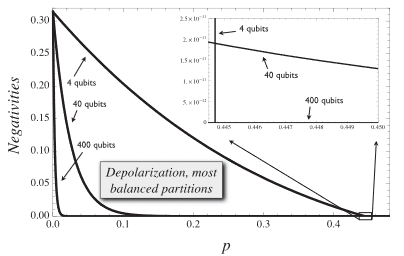

# Classic Papers

## 2002 Robustness of multiparty entanglement

### Introduction

#### Question

- how common is large-scale entanglement?

#### Intuitions

- entanglement seems fragile under decoherence
- Volume of inseparable states is much larger

#### Research Approach

- study how fast the entanglement disappears, quantifying the robustness
- Noise:

  - partially depolarizing channel
  - act on subsystem independently

- State:

  - $|GHZ\rangle$
  - spin-squeezed state

### Results

#### GHZ

$$
d_{crit} =1- s_{c r i t}(n)=1- \frac{1}{\sqrt{2^{2-2 / n}+1}}
$$

- robustness increases with the number of atoms
- GHZ is the comparatively robust

#### Spin Squeezed

attained after a quantum process that decreases the variance of one of the angular momentum components in an ensemble of particles with a spin.

$$
\xi^{2}=\frac{n\left\langle J_{x}^{2}\right\rangle}{\left\langle J_{y}\right\rangle^{2}+\left\langle J_{z}\right\rangle^{2}}
$$

if $\xi<1$, the state is entangled. Given a large amount of atoms, we could have state with $\left\langle J_{z}\right\rangle=\zeta n / 2$, $\langle J_X\rangle = \langle J_Y\rangle = 0$.

$$
d_{crit} = 1- s_{c r i t}=1 - \frac{1}{\sqrt{1+\zeta^{2}\left(1-\xi_{0}^{2}\right)}}
$$

- robustness increases with the number of atoms

### Conclusion

- multiparty entanglement surprisingly robust
- large scale entanglement could be more frequent in natural systems
- entanglement generation

## 2008 Scaling Laws for the Decay of Multiqubit Entanglement

### Intro

#### Previous Results of GHZ states

- the last bi-partitions to loose entanglement are the most balanced ones
- first bi-partitions to loose entanglement are the least balanced ones

#### Questions

- IS ESD good enough to assess the robustness?

### Prepare

#### states: generalized GHZ

$$
|\Psi\rangle = \alpha |0\rangle^{\otimes N }+ \beta |1\rangle^{\otimes N}
$$

#### channels

- depolarizing(white noise)
- phase damping(loss of quantum coherence)
- generalized amplitude damping(exchange a quantum with thermal bath)

### results

#### Generalized amplitude-damping channel

##### zero temperature

$$
p_c(k) = min\{1, |\alpha/\beta|^{2/N}\}
$$

- ($|\alpha|<|\beta$) ESD time increase with N

##### arbitrary temperature

$$
p_{c}^{\operatorname{Diff}}(N / 2)=1+2|\alpha \beta|^{2 / N}-\sqrt{1+4|\alpha \beta|^{4 / N}}
$$

- largest ESD time for (N/2,N/2) partition

#### depolarizing channel

$$
p_{c}^{\mathrm{D}}(N / 2)=1-\left(1+4|\alpha \beta|^{2 / N}\right)^{-1 / 2}
$$

- ESD time increase with N

#### phase damping channel

- No ESD

#### environment creates bound entanglement

- For (1,N-1)partition, Negativity == 0
- For other partition, Negativity may not be zero

#### ESD means little for large N system

##### ESD time increase with N

##### Negativity dropping rate at the beginning increase with N

## 2007 Bound entanglement in the XY model

pass

## 2009 Robustness of highly entangled multiqubit states under decoherence

### introduction
