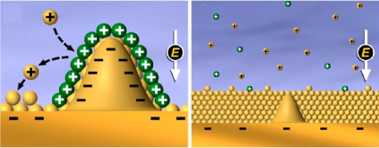
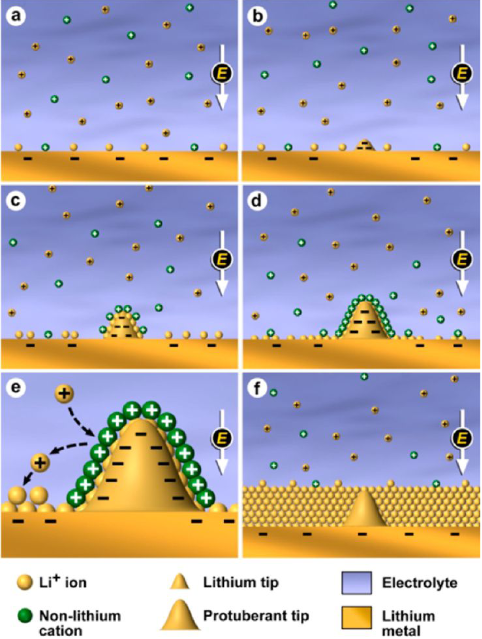
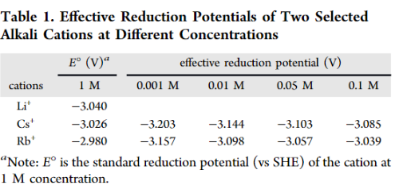

# Dendrite-Free Lithium Deposition via Self-Healing Electrostatic Shield Mechanism

Rechargeable lithium metal batteries
dendritic lithium growth

## Introduction

Most approaches to suppress dendrite formation focus on improving the stability and uniformity of solid electrolyte interface(SEI) by add formation additives.

bad part : additives gets consumed by SEI.

Another approach : mechanical barrier

bad part : no effect on the fundamental formation

## Experimental section

### modeling and simulations

1. ions were considered as spheres with the radii equal to the
corresponding ionic radii

2. The positive and negative ions interact
with each other via Coulomb force, excluded volume, and ion
correlation interactions

## Results and discussion

### Self-Healing Electrostatic Shield(SHES) Mechanism

This mechanism depends on an electrolyte additive cation that has an effective reduction potential lower than that of Li ion.

Li reduction potential > applied voltage > additive reduction potential

1. Li deposited on the substrate and form some protuberant tips
2. additive will accumulate in the vicinity of the tip $\to$ a shield
3. the shield will repel those incoming $Li^{+}$

Nernst equation

$$
E_{\text {Red }}=E_{\text {Red }}^{\phi}-\frac{R T}{z F} \ln \frac{\alpha_{\mathrm{Red}}}{\alpha_{\mathrm{Ox}}}
$$

if chemical activity $\alpha_{x}$ of additive could be lower than that of $Li^{+}$, then we got a lower reduction potential

### Dendrite-Free Li Films Deposited with SHES Additives
